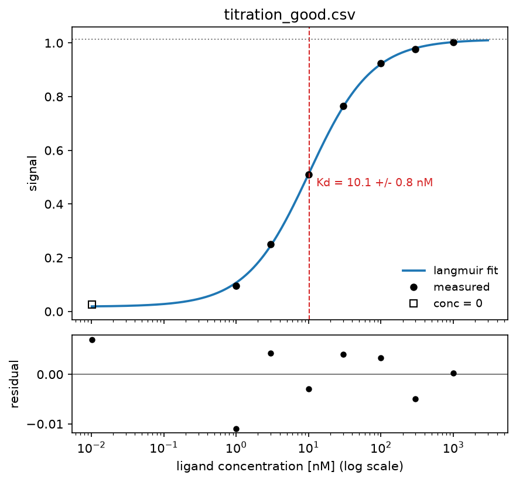

# affinityfit

[](https://pypi.org/project/affinityfit/)
[](https://pypi.org/project/affinityfit/)
[](https://github.com/matsudan/affinityfit/actions/workflows/ci.yml)
[](https://github.com/matsudan/affinityfit/blob/main/LICENSE)

🚧 This library is currently under development and may change significantly.

A Python library that fits **Kd** and related parameters from concentration and
signal data, and diagnoses whether the resulting estimate can be trusted.

Any observable that is linear in the fraction bound follows the same model (a
saturation curve), regardless of the measurement technique. NMR peak intensity,
SPR steady-state response, and initial enzyme velocity are all examples.

```
signal = baseline + Bmax * [L] / (Kd + [L])
```

Several datasets can be fitted simultaneously, sharing parameters across them or
holding some constant. A curve whose measured range does not bracket Kd is
otherwise undetermined on its own; sharing a parameter with a better-sampled
dataset can make the estimate identifiable.

## Usage

```bash
uv add affinityfit
```

```python
from affinityfit import fit, load_csv

conc, signal = load_csv("titration.csv")
res = fit(conc, signal, unit="nM")

print(res.report())
print(res.params["kd"], res.intervals["kd"].format("nM"))
for warning in res.warnings:
    print(warning)
```

The input CSV has concentration in the first column and signal in the second.
Header rows, comment rows, and blank rows are skipped. Repeated rows at the same
concentration are used as replicates as-is.

Missing values (blank cells), `nan`, and `inf` raise an error with the row number.
Silently dropping a blank row would change the number of points, and with it the
degrees of freedom and the diagnostics.

```csv
concentration_nM,signal
0,0.0249
1,0.0963
3,0.2493
10,0.5090
30,0.7657
100,0.9249
300,0.9758
1000,1.0035
```

Output of `report()`:

```
model    : langmuir  (1:1 binding: signal = baseline + Bmax * L / (Kd + L))
interval : profile
Kd       = 10.1 +/- 0.8 nM
Bmax     = 0.995 +/- 0.017
baseline = 0.018 +/- 0.014
R^2      = 0.9998   (n = 8)
AICc     = -71.12   (AIC = -77.12)

診断チェック: 問題は検出されませんでした。
```

If the concentration of the fixed partner (a receptor, a lectin, and so on) is
known, pass it in to enable the ligand-depletion check.

```python
res = fit(conc, signal, receptor_conc=1.0, unit="nM")
```

Pass `model=` to switch models.

```python
from affinityfit import hill

res = fit(conc, signal, model=hill)  # test for cooperativity
print(res.intervals["n"].contains(1.0))
```

Fitting several datasets simultaneously, sharing or fixing parameters:

```python
from affinityfit import Dataset, fit_global

res = fit_global(
    [Dataset("oxidized", conc, sig_ox), Dataset("reduced", conc, sig_red)],
    shared=["bmax"],  # estimate a single value across all datasets
    fixed={"baseline": 0.0},  # hold at a constant, not estimated
    unit="mM",
)
print(res.report())

# Pull out one dataset. Its warnings and notes come along with it.
sub = res.result_for("oxidized")
print(sub.report())
x, y = sub.curve()
```

`warnings` are problems, `notes` are remarks such as "sharing is what made this
estimate possible". `GlobalFitResult.warnings` / `.notes` return everything with a
`[dataset name]` prefix, while `result_for()` returns the ones for that dataset
(plus any that concern the fit as a whole) without the prefix.

## Weighting

By default every point counts equally, which assumes the measurement error is the
same size everywhere. That holds for a system like SPR response units, but not for
fluorescence, luminescence, or absorbance, where the error scales with the signal.
Since a saturation curve moves the signal from baseline to baseline+Bmax, the
absolute error near saturation can be tens of times larger than at low
concentration.

```python
res = fit(conc, signal, sigma=0.01 + 0.10 * signal)  # per-point standard deviation
```

`sigma` is treated as relative; the overall scale is still estimated from the
residuals, so the result is unchanged under a constant rescaling. In a global fit,
`Dataset(..., sigma=...)` can be given per dataset, which also carries over the
relative weight between datasets (one being ten times noisier than another, say).

sigma must be given for **either every dataset or none of them**. Giving it to only
some would leave the others with an implicit weight of 1, so the relative weight
between datasets would be decided by the absolute scale of sigma (whether it is
written as a fraction, a percentage, or ppm). Mixing the two raises an error.

Fitting heteroscedastic data without weights costs more than precision: **it also
narrows the confidence interval** (measured for Kd=10 with 30% proportional error,
95% CI coverage was 79% unweighted versus 94% with sigma supplied).

The diagnostics warn when the size of the residuals grows with the fitted value.

## Confidence Intervals

`ci=` selects one of three methods.

| Method | Description |
|---|---|
| `profile` (default) | Pins Kd and refits everything else, taking the boundary where the residual sum of squares rises significantly (an F-test). The interval can be asymmetric; when one side cannot be pinned down it comes back as, for example, `Kd > 1.6` |
| `asymptotic` | Reads the interval off the curvature of the covariance matrix. The fastest option, but can claim a finite two-sided interval even for unidentifiable data |
| `bootstrap` | Resamples the data and refits to get the distribution of the estimate directly. Resamples replicates when given, residuals otherwise |

Reporting error from repeated experiments is standard practice in this field.
Passing replicate measurements follows that convention.

```python
res = fit(conc, signal, ci="bootstrap", replicates=reps, n_boot=2000)
```

`Dataset` also accepts replicates on their own (`signal` is then their mean).

```python
Dataset("oxidized", conc, replicates=reps)
```

`n_boot` must be at or above the minimum needed for a percentile interval (100),
or it raises an error; below that, no interval can be formed.

The reported precision follows the uncertainty. A measurement with a 17% relative
error does not warrant three significant figures, so `Kd = 4.70e-8` is reported as
`(4.7 +/- 0.8)e-08` instead.

## Model

| Model | Parameters | Use |
|---|---|---|
| `langmuir` (default) | kd, bmax, baseline | 1:1 binding. `signal = baseline + Bmax·L/(Kd+L)` |
| `hill` | kd, bmax, baseline, n | Cooperativity, judged by whether the confidence interval of n contains 1. Read the caveat below before claiming n > 1 |
| `michaelis` | km, vmax, baseline | Enzyme kinetics. Same equation as langmuir, but Km is not an affinity |
| `ic50` | ic50, bmax, baseline, hillslope | Dose-response (4PL). A negative `bmax` inhibits, a positive one gives an EC50 curve |
| `tight_binding` | kd, bmax, baseline, rt | 1:1 binding solved for ligand depletion, for a receptor not dilute against Kd |

`bmax` in `langmuir` and `hill` is not restricted in sign. An observable that
**decreases** on binding (fluorescence quenching, a drop in intensity) still has
the same meaning for Kd, expressed as a negative response coefficient in the same
equation. `vmax` in `michaelis` is a rate and stays non-negative, so use `langmuir`
or `hill` for decreasing data. Fitting the wrong kind of model to the data warns
rather than returning a plausible-looking number.

`Km = (k_off + k_cat)/k_on`, and only equals Kd when `k_cat` is negligible.

Kd, Km and IC50 are optimised on a logarithmic scale. Handled linearly, the fitted
result would depend on the unit of concentration, reaching a relative error of
6800% for a picomolar affinity (Kd = 1e-12 M) expressed in molar units. As it
stands, Kd is recovered to within 1e-6 relative error across 18 orders of
magnitude, from fM to 100 M, giving the same answer whether the same experiment is
written in M, nM, or pM.

### Dose-Response and Ki

`ic50` is the four-parameter logistic. It is the same equation as `hill`, under the
names used to report a dose-response curve, and without the cooperativity checks: a
slope near 1 is the ordinary case there rather than a finding.

```python
from affinityfit import ic50

res = fit(conc, response, model=ic50, unit="nM")
print(res.params["ic50"], res.params["hillslope"])
```

A displacement IC50 is not a property of the competitor alone: raising the
concentration of the labelled ligand being displaced raises the IC50 with it. Dividing
by `1 + [tracer]/Kd_tracer` removes that dependence, which is what makes Ki comparable
between assays run at different tracer concentrations.

```python
from affinityfit import Interval, ki_from_ic50

ki = ki_from_ic50(res, tracer_conc=5.0, tracer_kd=Interval(point=2.0, lower=1.6, upper=2.4))
print(ki.format("nM"))
```

Pass the whole result rather than one interval out of it, and give the tracer constant
as an `Interval` when its uncertainty is known. Both matter:

**The standard form assumes a slope of 1.** It is derived for a single site under
competition, and a fitted slope whose interval excludes 1 says that derivation does not
apply. The modified forms that cover a slope away from 1 raise the terms to powers and
[do not agree with one another](https://pubmed.ncbi.nlm.nih.gov/12481843/), so choosing
between them is yours rather than this library's; what the library does is refuse to
stay quiet. Only the `FitResult` carries the IC50 and the slope together, so only that
overload can check it. Passing `res.intervals["ic50"]` computes the same number without
the check.

**The tracer constant's own error usually dominates.** With `r = [T]/Kd*`, its relative
error reaches Ki damped by `r/(1+r)`, so at `[T] = 2.5·Kd*` a 20% uncertainty on `Kd*`
puts 14% onto Ki, against about 5% from a well-measured IC50. Treating `Kd*` as exact
here reports **±5% where the experiment supports ±15%**. The two are independent, so
they combine in quadrature, each side of the interval separately; asymmetry survives,
an undetermined limit stays undetermined, and a lower limit driven past zero is reported
as undetermined rather than as a Ki of zero. `tracer_conc` is taken as exact.

For competitive enzyme inhibition the same expression applies with `[S]` and `Km`.

The relation also assumes the competitor and the tracer exclude each other from one
site, and that the free tracer concentration is close to the total. Neither is something
a fit can check, since the curve looks the same either way.

### Ligand Depletion

Every model in the table except `tight_binding` assumes the free ligand concentration
equals the total one. That stops holding once the receptor is not much more dilute than
Kd, because each molecule bound is one fewer left in solution. The curve still looks
like a saturation curve, so nothing in the fit statistics gives the problem away: with
the receptor at five times Kd, `langmuir` reports **Kd = 3.99 where the truth is 1.0,
at R² = 0.9919**.

`tight_binding` solves the 1:1 equilibrium without that assumption. Pass the total
receptor concentration as `rt`, normally as a constant.

```python
from affinityfit import tight_binding

res = fit(conc, signal, model=tight_binding, fixed={"rt": 5.0}, unit="uM")
```

Left free instead, `rt` is estimated from the data, which measures the **active**
concentration: the fraction of the immobilised or pipetted receptor that is actually
binding. Depletion changes the shape of the curve and not only its midpoint, which is
what keeps `rt` and Kd from trading off against each other.

```python
res = fit(conc, signal, model=tight_binding, unit="uM")
print(res.intervals["rt"].format("uM"))
```

The diagnostic that recommends this model (see below) is suppressed once the model is
in use. Two limits are worth knowing:

- `fixed=` applies one value to every dataset, so in a global fit spanning several
  receptor concentrations `rt` cannot be fixed per dataset. Fit those separately.
- The checks on where the measurements sit compare the range against Kd. Depletion
  reaches the plateau at a lower multiple of Kd than a hyperbola does, so those
  thresholds are conservative here and may still ask for higher concentrations than
  this model needs.

### Cooperativity Under Depletion

Depletion does not only shift the curve, it steepens it, and `hill` reads that
steepness as an exponent. The same 1:1 data as above, with no cooperativity anywhere in
the system, fits `hill` at **n = 1.43 [1.28, 1.59], R² = 0.9989**: the interval excludes
1, so the check documented above (`intervals["n"].contains(1.0)`) reports cooperativity
that does not exist.

There is no model here that solves depletion and cooperativity at once, and adding one
would mean bolting an exact conservation law onto the Hill equation, which is
phenomenological to begin with. So cooperativity has to be measured where depletion is
absent: **keep the receptor at or below Kd/10 for that question.**

A significant n > 1 is therefore always reported with the alternatives that produce the
same shape (depletion, self-association, a reading taken before equilibrium). Passing
`receptor_conc=` lets the first of them be checked rather than only listed; without it
the warning says so instead of staying silent.

## Model Selection

Use `aicc` (the corrected Akaike information criterion) to compare models or
parameter-sharing schemes. `aic` is kept for reference, but the uncorrected AIC is
only asymptotically valid and favours the model with more parameters at the scale
of a typical titration (6-15 points, 3-6 parameters, n/k of 2-5).

This has been confirmed empirically as well: with fewer points, the uncorrected
AIC tends to favour the model with more parameters.

```python
shared.aicc < free.aicc
fit_global(ds, model=hill).aicc < fit_global(ds, model=langmuir).aicc
```

When the sample is too small for the correction to be defined (n − k − 1 ≤ 0),
`aicc` is infinite. `report()` shows AICc first, with AIC in parentheses for
reference.

## Diagnostics

It is not unusual for Kd to be undetermined even when R² is above 0.99. The
following are warned about automatically. A quantity whose name changes by model
(Kd, Km) is shown under that model's own label.

There are two kinds of diagnostics: whether **the fit itself is sound**, and
whether **the measurements are placed well**.

| Condition | Meaning |
|---|---|
| Amplitude collapsed to near 0 | The fit is effectively a flat line; the model cannot express the shape of the data |
| R² < 0.5 | The model does not capture the trend in the data; the value of Kd is meaningless |
| R² < 0.9 | Low for a saturation curve; either noise or the wrong model |
| Systematic sign in the residuals | The shape of the model does not match the mechanism, even with a high coefficient of determination |
| A parameter stuck at a bound | That value is an artefact of the constraint, not an estimate, and cannot be reported |
| Highest concentration < 3 * Kd | Saturation not reached; Kd and Bmax cannot be mathematically separated, so the conclusion is limited to "Kd > highest concentration" |
| Highest concentration < 10 * Kd | The estimate of Bmax is unstable, and the confidence interval on Kd widens as well |
| Data points < 2 * estimated parameters | Not enough information; confidence intervals are indicative only (fixed parameters are not counted) |
| 0-1 points near Kd (Kd/3 to 3Kd) | The inflection point of the curve is underdetermined; adding points here helps the most |
| Lowest concentration > Kd | Every point sits on the saturated side; Kd is set by extrapolation and should not be reported to extra significant figures |
| No points at or below Kd/10 | baseline is estimated together with the curve, which can shift Bmax |
| Receptor concentration > Kd/10 | Ligand depletion causes Kd to be overestimated; switch to `tight_binding`. Not reported when that model is already in use. With `hill`, also states that n is inflated and cooperativity cannot be judged at all under these conditions |
| Hill coefficient n's CI contains 1 | Cooperativity cannot be claimed |
| Hill coefficient n significantly > 1 | Positive cooperativity is one reading, but depletion, self-association and a pre-equilibrium reading give the same shape. Says so when `receptor_conc` was not supplied to check the first of them |
| Hill coefficient n significantly < 1 | Negative cooperativity, heterogeneous sites, or a heterogeneous sample | `ki_from_ic50` raises a `UserWarning` rather than a diagnostic, since it is called after the fit and has no result of its own to attach one to.
| Residual size proportional to the fitted value | Heteroscedastic error; omitting `sigma` narrows the interval |
| Zero degrees of freedom (points ≤ parameters) | The curve passes through every point by construction; no confidence interval can be computed |
| Rank-deficient Jacobian | Parameters cannot be told apart, so the values are not uniquely determined; more concentrations are needed |
| One side of a confidence interval is undetermined | The point estimate should not be reported; sharing or a wider measured range is needed |

In a global fit, remarks whose premise is removed by sharing or fixing are
suppressed. For example, if `bmax` is shared, "Kd and Bmax cannot be separated"
no longer applies, and a note saying "sharing is what made this estimate
possible" appears instead. That note is withheld, though, when the fit itself is
broken (R² < 0.5, or a collapsed amplitude), since it would otherwise contradict
the other advice.

`examples/titration_unsaturated.csv` is an example where R² = 0.9936 looks like a
good fit, but the highest concentration is only a third of Kd, so the upper limit
is undetermined and the result can only be reported as `Kd > 76 nM`.

When a confidence interval cannot be computed (zero degrees of freedom, a
rank-deficient Jacobian, an inner refit that fails to converge, or too few
bootstrap resamples succeeding), no number is invented; the interval is reported
as undetermined, with the reason given. The point estimate itself is still
returned.

Residuals are tested with both a runs test (Wald-Wolfowitz) and lag-1
autocorrelation, and a warning fires if either is significant. The false-positive
rate is kept under 2%.

### Statistics

The warnings are judged at a fixed significance level. Stacking tests across
several datasets raises the false-positive rate accordingly, so the underlying
statistic and p-value are returned as-is.

```python
res = fit(conc, signal)
for s in res.statistics:
    print(s.name, s.statistic, s.p_value)
```

For several datasets, these are available per dataset through
`GlobalFitResult.statistics_per["dataset name"]`. `residual_autocorrelation` is
judged against a fixed threshold rather than a p-value, so its `p_value` is
`None`.

## Plotting

| Method | Returns |
|---|---|
| `res.curve(conc_min, conc_max, n)` | The fitted curve `(x, y)`, log-spaced |
| `res.predict(conc)` | The fitted value at an arbitrary concentration |
| `res.residuals(conc, signal)` | Residuals (observed minus fitted) |

```python
import matplotlib.pyplot as plt

fig, ax = plt.subplots()
ax.plot(*res.curve(), "-")
ax.plot(conc, signal, "o")
ax.set_xscale("log")
```

Keep the concentration axis logarithmic. On a linear axis the low-concentration
region collapses, hiding both the curvature near Kd and design issues such as the
measurements being skewed toward saturation.

`examples/plot_fit.py` is a sample that draws the measured points, the fitted
curve, and a residual panel in a single figure. It is not part of the
distribution.

```bash
uv run python examples/plot_fit.py examples/titration_good.csv --unit nM
```

Running this sample on `examples/titration_good.csv`:


